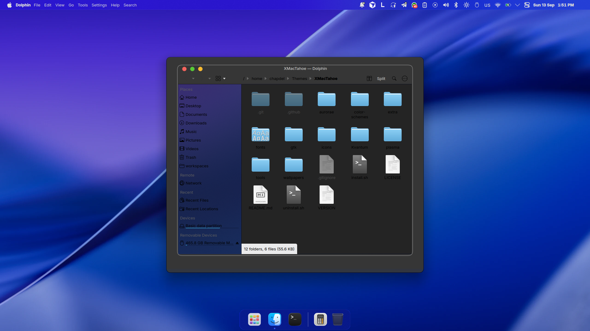
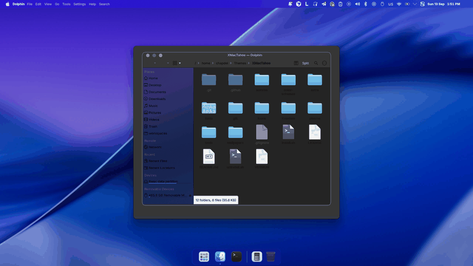

# XMacTahoe — a self-contained macOS Tahoe-style global theme for KDE Plasma 6

Everything needed to reproduce a macOS Tahoe-like desktop on KDE Plasma 6 in one go, with no dependency on the KDE Store. Built and tested on Fedora 44 / Plasma 6.7 (Wayland).





## Installation

```bash
tar -xzf XMacTahoe-vX.Y.Z.tar.gz && cd XMacTahoe
./install.sh              # install everything and apply the dark variant
./install.sh --layout     # same, plus recreate the top bar and the dock (use on a fresh machine)
./install.sh --light      # apply the light variant
./install.sh --no-apply   # copy the files without changing the active theme
./install.sh --no-round-corners   # skip the KWin rounded-corners effect
./install.sh --accent purple      # accent color: blue purple pink red orange yellow green graphite
./install.sh --wallpaper XMacTahoe-Liuice   # alternative day/night wallpaper by vinceliuice
./install.sh --root               # also run the root steps (system-wide copy + login screen, Plymouth)
./install.sh --auto-appearance    # light after sunrise, dark after sunset (like macOS "Auto")
./install.sh --no-glass           # opaque panels and windows, no blur (modest GPUs)
./install.sh --update             # fetch the latest release and re-run the installer
./uninstall.sh                    # back to Breeze Dark, remove everything (--keep-files keeps the files)
```

System dependency (Fedora): `kvantum` (dnf). `plasma-applet-appgrid` ships as an RPM in `extra/rpm/` (COPR `scujas/plasma-applet-appgrid` repo file included) and is installed by the script when missing.

Two optional steps need root and are printed at the end of the install:

- **Boot splash (Plymouth)**: `sudo extra/xmactahoe-boot-install` installs the `xmactahoe` theme (Apple-style logo, spinner, black background) and rebuilds the initramfs.
- **Login screen and all users**: `sudo extra/xmactahoe-system-install` copies the themes into `/usr/share`, makes XMacTahoe.Dark the system default (`/etc/xdg`) and points the Plasma Login Manager wallpaper to XMacTahoe. `./install.sh --root` runs both root steps.

## What you get

| Component | Name |
|---|---|
| Global themes | `XMacTahoe.Dark`, `XMacTahoe.Light`, `XMacTahoe.Splash` — with panel layout, lock screen and splash |
| Plasma themes | XMacTahoe-Dark (glass panels and popups), XMacTahoe-Light |
| Color schemes | XMacTahoeDark, XMacTahoeLight |
| Icons | XMacTahoe (base, from MacTahoe by vinceliuice), XMacTahoe-Night, XMacTahoe-Day |
| Cursors | XMacTahoe-cursors (WhiteSur cursors) |
| Application style | Kvantum: XMacTahoeDark, XMacTahoe (translucent windows with blur) |
| Window decorations | Aurorae: XMacTahoe-Night, XMacTahoe (traffic lights, symbols on hover, standard shadows) |
| Wallpapers | XMacTahoe (dynamic day/night, zayronxio), XMacTahoe-Liuice (day/night, vinceliuice) |
| GTK | MacTahoe-Dark, MacTahoe-Light, libadwaita included; GTK 3/4 settings |
| Widgets | kppleMenu (Apple menu), Window Title Fork, Flex Hub (control center), Command Output, Simple Separator, AppGrid (RPM) |
| Fonts | Inter Variable, JetBrains Mono |
| Apps | Dolphin (Finder-like defaults), Konsole (macOS profile + `XMacTahoe` Terminal.app-like palette) |

Based on Apple Tahoe / AppleDark-ALL / Mkos Big Sur (zayronxio) and MacTahoe / MacSequoia / WhiteSur (vinceliuice). GPL-3.0.

## Desktop layout

- **Top bar** (24 px, edge to edge): Apple menu, window title, global menu, system tray with SF Symbols-style glyphs, control center (Flex Hub), date and time. Nearly transparent (18 %) with KWin blur and contrast, like the Tahoe menu bar.
- **Dock** (floating, dodges windows): Applications launcher, pinned apps, calculator, trash.
- **Panels** run in "translucent" mode so blur is always applied.

## Keyboard shortcuts (AppGrid launcher)

| Key | Action |
|---|---|
| `Meta` (Super) alone | full application grid |
| `Alt+Space` | AppGrid compact mode (search) |

The AppGrid widget lives **invisibly** (transparent icon) at the right end of the top bar: when it sat in the dock, every `Meta` press made the dock pop up. The dock keeps an "Applications" icon (`extra/applications/xmactahoe-appgrid.desktop`) that opens the same grid.

Both shortcuts are wired by `extra/kde-desktop-repair`, copied to `~/.local/bin`. If they ever stop responding (widget recreated, theme re-applied), run `kde-desktop-repair` (`--check` only diagnoses).

## Rounded corners (Tahoe-style)

Plasma only rounds the top of windows. The package installs and configures the KWin effect **KDE Rounded Corners** (matinlotfali, COPR `matinlotfali/KDE-Rounded-Corners`, package `kwin-effect-roundcorners`): 18 px radius on every window including maximized ones, a subtle white outline, no rounding in full screen. Settings live in `extra/kwinrc-round-corners.conf`, applied by `extra/xmactahoe-round-corners` (can be re-run alone). GUI: System Settings → Desktop Effects → Rounded Corners.

## Light / dark switching

The light/dark toggle in the Flex Hub widget (or `plasma-apply-lookandfeel -a XMacTahoe.Light|Dark`) changes the global theme. Since Plasma does not drive Kvantum or GTK, `extra/xmactahoe-sync-variant` (triggered by the user systemd unit `xmactahoe-variant.path`) immediately aligns Kvantum, the GTK theme, libadwaita and the icon theme with the active variant. Qt applications that are already open pick up the new style when relaunched.

## Menu bar icons (SF Symbols style)

The system tray glyphs (Wi-Fi, sound, Bluetooth, battery, brightness, notifications, clipboard, updates, Telegram, control center) are generated by `tools/gen-tray-icons.py` into the `status/*` and `*/panel` directories of the XMacTahoe-Night/Day icon packs and into `icons/` of the Plasma themes. To regenerate after editing the script:

```bash
python3 tools/gen-tray-icons.py icons plasma/desktoptheme                                   # inside the package
python3 tools/gen-tray-icons.py ~/.local/share/icons ~/.local/share/plasma/desktoptheme   # installed copy
rm ~/.cache/icon-cache.kcache && systemctl --user restart plasma-plasmashell
```

Applications that hand the tray a bitmap instead of an icon name (qBittorrent, Whatsie, ...) keep their own colors.

## Other macOS-like touches

- **Apple menu** entries wired for Plasma 6 on Wayland: About, System Settings, App Store (Discover), Force Quit (KWin), Sleep, Restart / Shut Down / Log Out (Plasma prompts), Lock Screen.
- **Animations**: magic lamp minimize, Overview on the top-left corner, Show Desktop on the top-right corner (`extra/kwinrc-effects.conf`).
- **Notifications** top right, 5 s.
- **Lock screen** provided by the global theme (`contents/lockscreen`): big clock at the top, avatar and password at the bottom, on the XMacTahoe wallpaper.
- **GTK apps use the KDE file dialogs** (`GTK_USE_PORTAL=1` via `extra/environment.d`, effective at next login).
- **Dolphin** defaults are only copied when no `dolphinrc` exists yet.

## Everyday command

`xmactahoe` (installed in `~/.local/bin`) wraps every helper: `light` / `dark`, `accent NAME`, `glass on|off|toggle`, `motion on|off|toggle` (reduced animations), `auto on|off|now` (sunrise/sunset appearance), `dynamic on|off|now` (eight-slot wallpaper following the sun), `wallpaper NAME`, `firefox`, `flatpak`, `rules`, `doctor [--fix]`, `update`, `restore`, `uninstall`. The Flex Hub control center gets three quick buttons: Glass, Auto appearance, Reduce motion.

`xmactahoe doctor` checks the whole installation (theme layers, Kvantum/GTK alignment, files, units, rounded corners, shortcuts) and `--fix` repairs what it can. The installer saves a restore point of your Plasma configuration before its first run; `xmactahoe restore` (or `./uninstall.sh --restore`) puts it back exactly.

## Applications that draw their own frames

- **Firefox**: vinceliuice's MacTahoe userChrome theme is applied to every profile (`xmactahoe firefox`; a default profile is created if Firefox was never started).
- **Flatpak**: user overrides expose the GTK theme, icons, cursors and libadwaita config to sandboxed apps (`xmactahoe flatpak`, updated on each light/dark switch). No Kvantum runtime exists yet for the KDE 6.10/6.11 platforms, so Qt Flatpaks keep their own style.
- **Electron and CSD apps**: KWin window rules force the theme's decoration on Chrome, Spotify, Typora, GitHub Desktop, WhatsApp clients, Telegram, Zed, Cursor, Postman, Claude, VS Code and Obsidian (`xmactahoe rules`).

## Dynamic wallpaper

`xmactahoe dynamic on` enables a timer that picks one of eight frames (deep night, late night, dawn, morning, midday, afternoon, sunset, dusk) generated from vinceliuice's day/night pair, relative to your sunrise and sunset.

## Automatic appearance

`./install.sh --auto-appearance` enables a user timer that switches to XMacTahoe.Light after sunrise and back to XMacTahoe.Dark after sunset, like the macOS "Auto" setting. The location comes from `~/.config/xmactahoe/location` (`latitude longitude`) or, failing that, from KWin Night Light's auto-detected coordinates. Only the ten minutes after each event trigger a switch, so a manual toggle in Flex Hub is respected until the next sunrise or sunset. `extra/xmactahoe-auto-appearance --now` applies the expected variant immediately.

## Glass on or off

`extra/xmactahoe-glass off` makes panels, popups and Qt windows opaque and disables KWin blur and contrast, for modest GPUs; `on` restores the glass. `./install.sh --no-glass` does it at install time.

## Quick Look

Right-click a file in Dolphin → **Quick Look** opens it in a lightweight viewer chosen by type: images in Gwenview full screen, PDF and EPUB in Okular presentation mode, video and audio in Haruna/Dragon/VLC, text read-only in Kate. Dolphin exposes no selection over D-Bus, so a Space-bar shortcut is not possible without a plugin.

## Do Not Disturb

`xmactahoe dnd on 18:00` mutes notifications until 18:00, `off` restores them, `schedule 22:00-07:00` mutes them every day on that window (user systemd timer), like a macOS Focus schedule.

## Editors and terminal

Konsole ships a `macOS` profile with the `XMacTahoe` (dark) and `XMacTahoe-Light` Terminal.app-like palettes; the light/dark sync switches the profile palette for new windows. Kate and KWrite get the Xcode-like **XMacTahoe Dark** and **XMacTahoe Light** color themes, also switched by the sync for new windows.

## Splash screen

`XMacTahoe.Splash` continues the Plymouth boot screen: black background, white logo and a thin progress bar.

## Accent color

`extra/xmactahoe-accent <name>` (or `./install.sh --accent <name>`) applies one of the macOS accents — blue, purple, pink, red, orange, yellow, green, graphite — to the Plasma accent color, both XMacTahoe color schemes (selection, focus, hover) and Kvantum (highlight and accent paths). Files are regenerated from `extra/pristine`, so the accent can be changed at will. GTK and folder icons keep the MacTahoe blue.

## Checks and CI

`tools/check-package.py` validates the package: shell and Python syntax, every `defaults` entry pointing to a bundled component, Aurorae rc names, Kvantum pairs, all Plasma theme SVGs parsing with the color stylesheet inside `<defs>`, layouts parsing as JavaScript and only referencing bundled widgets, and a dry run of the glyph generator. It runs on every push through GitHub Actions (`.github/workflows/check.yml`). `tools/fix-svg-stylesheets.py` repairs third-party Plasma themes whose color stylesheet is misplaced (the root cause of the "light bar" bug). `tools/export-layout.py` re-exports the live panel layout into the package, normalized to a single screen so it applies to any monitor count.

## Maintenance

- Edit inside this folder, then re-run `./install.sh`.
- After changing a Plasma theme SVG: `rm ~/.cache/plasma_theme_XMacTahoe-*.kcache ~/.cache/ksvg-elements && systemctl --user restart plasma-plasmashell`.
- After changing rounded-corners settings: `extra/xmactahoe-round-corners` (a plain KWin reconfigure does not reload that effect's config).
- Release: `git tag vX.Y.Z && tar --exclude='XMacTahoe/.git' -czf ../XMacTahoe-vX.Y.Z.tar.gz XMacTahoe && gh release create vX.Y.Z ../XMacTahoe-vX.Y.Z.tar.gz`.

## Changelog

See [CHANGELOG.md](CHANGELOG.md). Releases are published with `tools/release.sh`, which builds the archive, `SHA256SUMS` and, with `--sign`, a detached GPG signature.
